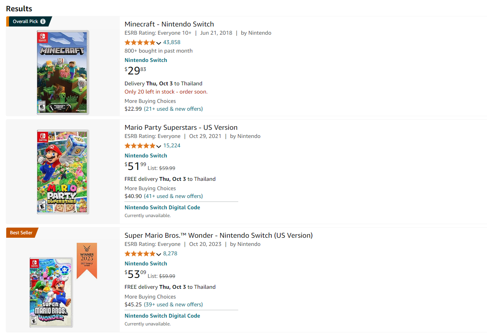

# Amazon Product Scraping

This project scrapes product data from Amazon on Nintendo game cards.

### Project Status: `Complete`



## Features

- Product details
  - **Title**
  - **Price**
  - **Rating**
  - **Number of Reviews**

## Requirements

To run this project you need the following Python libraries

- `BeautifulSoup4`
```shell script
pip install bs4
```

- `requests`
```shell script
pip install requests
```
